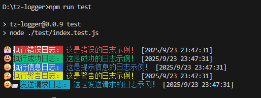

# 介绍
```
这个日志工具 ( tz-logger ) 可在 Node.js 控制台中打印彩色日志和表情包，并且同时会将打印出来的信息写入指定目录文件。
```

# 基础用法
```javascript

import { TzLogger } from "tz-logger";

const logger = new TzLogger();

logger.errorLogger("这是错误的日志示例！");
logger.successLogger("这是成功的日志示例！");
logger.infoLogger("这是提示信息的日志示例！");
logger.warnLogger("这是警告的日志示例！");
logger.requestLogger("这是发送请求的日志示例！");

```

# 效果



# 自定义
如果您需要自定义颜色，效果等属性。
请参考下方：

```javascript
const logger = new TzLogger({ 
    errorPreText: "修改错误前缀提示信息" ,
    ...
});
```

# 自定义参数
```javascript
{
    // 写入文件路径
    logFilePath = "./logger.txt";

    // 出错配置
    errorTextColor = "31";
    errorBgColor = "41";
    errorIcon = "😤";
    errorPreText = "执行错误日志：";

    // 警告配置
    warnTextColor = "33";
    warnBgColor = "43";
    warnIcon = "🤔";
    warnPreText = "执行警告日志：";

    // 成功配置
    successTextColor = "32";
    successBgColor = "42";
    successIcon = "😃";
    successPreText = "执行成功日志：";

    // 信息配置
    infoTextColor = "34";
    infoBgColor = "44";
    infoIcon = "🙂";
    infoPreText = "执行信息日志：";

    // 请求配置
    requestTextColor = "36";
    requestBgColor = "46";
    requestIcon = "🙂📨";
    requestPreText = "发送请求日志：";
}
```